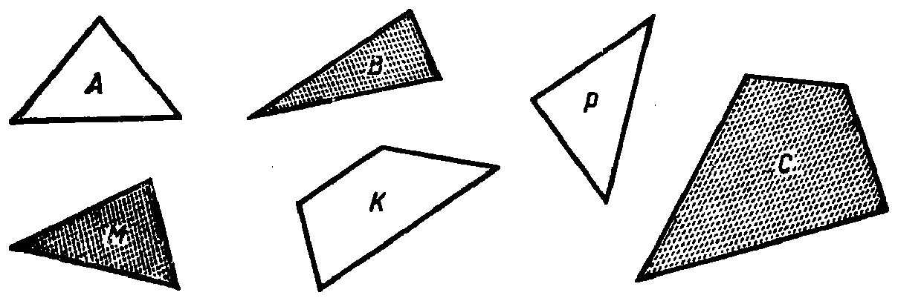

---
{
  "printed_page": 2,
  "book": "5m",
  "page": 11,
  "source": {
    "pdf": "5m 苏联十年制学校教材 数学 五年级.pdf",
    "pdf_sha256": "63de04ad3638091845160482903031cef4728857ad41aac477ffb473222cbe84",
    "pdf_page": 11
  },
  "render": {
    "dpi": 300,
    "w": 1504,
    "h": 2172,
    "sha256": "50833088c862422367b3feaba58e17b6db69131c5505eb3ed4d97206a35da3ba"
  },
  "profile": {
    "id": "soviet-cn",
    "sha256": "dad8d974ba16880482f359073263269de8c405ccf8cb17dc4215fad11da44849"
  },
  "schema": "ld-page2class/page@3",
  "notes": [],
  "printed_lines": 19,
  "figures": [
    {
      "id": "fig-03",
      "label": "图 3",
      "box": [
        127,
        487,
        1184,
        382
      ]
    }
  ],
  "provenance": {
    "cap": "1",
    "normalized": true
  }
}
---

<!-- p cont -->
形是集合 $M$ 的元素，但不是集合 $K$ 的元素.

<!-- ex 1 open -->
从图 3 的各图形的集合中把下列各子集选出来：

<!-- fig 图 3 box 127,487,1184,382 -->

<!-- cap 图 3 -->
图 3

<!-- ex 1 cont -->
1）四边形；  4）带阴影的图形；
2）三角形；  5）白色三角形；
3）多边形；  6）圆.

<!-- ex 2 -->
从集合 {52 164，32 415，11 218} 中把下列各数的子集
选出来：1）2 的倍数，2）3 的倍数，3）5 的倍数.

<!-- ex 3 -->
从图 3 的各图形的集合中选出子集 $\{A, K, P\}$，要按照什
么样的特征？

<!-- ex 4 -->
阿廖沙、别佳、谢尔盖都是瓦西亚的同学. 有时，瓦西亚
在上学途中遇到这些同学中的一个或几个. 写出瓦西亚
在上学途中可能遇到的同学的集合的全部子集.

<!-- ex 5 open -->
下面的集合 $A$ 是不是集合 $B$ 的子集？
1）$A=\{p, q, r\}$，$B=\{p, qr\}$；
2）$A$——学校中全体男生的集合，$B$——我们班全体学
生的集合；
3）$A$——各加盟共和国首都的集合，$B$——苏联各城市

<!-- foot -->
· 2 ·
