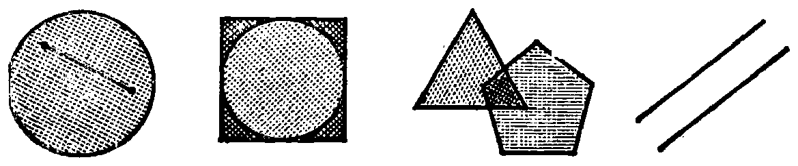

---
{
  "printed_page": 3,
  "book": "5m",
  "page": 12,
  "source": {
    "pdf": "5m 苏联十年制学校教材 数学 五年级.pdf",
    "pdf_sha256": "63de04ad3638091845160482903031cef4728857ad41aac477ffb473222cbe84",
    "pdf_page": 12
  },
  "render": {
    "dpi": 300,
    "w": 1504,
    "h": 2172,
    "sha256": "963837a17dc2a3c6d9457a3e100083fe7a25a68195d7b068fe7c85bf47cc0cf5"
  },
  "profile": {
    "id": "soviet-cn",
    "sha256": "dad8d974ba16880482f359073263269de8c405ccf8cb17dc4215fad11da44849"
  },
  "schema": "ld-page2class/page@3",
  "notes": [],
  "printed_lines": 22,
  "figures": [
    {
      "id": "fig-04",
      "label": "图 4",
      "box": [
        238,
        514,
        1145,
        221
      ]
    }
  ],
  "provenance": {
    "cap": "1",
    "normalized": true
  }
}
---

<!-- ex 5 cont -->
的集合；
4）$A=\{$莱蒙托夫、普希金$\}$，$B$——俄罗斯诗人的集合.

<!-- ex 6 -->
图 4 中哪一对图形里的一个图形的点的集合是另一个图
形的点的集合的子集？

<!-- fig 图 4 box 238,514,1145,221 -->

<!-- cap 图 4 -->
图 4

<!-- ex 7 -->
作三角形和四边形，使：
1）三角形是四边形的子集；
2）四边形是三角形的子集.

<!-- exhead -->
复习题

<!-- ex 8 -->
汽艇的速度为 12.8 公里/小时. 河水的流速是 1.7 公里/
小时. 分别求出汽艇在顺流和逆流时的航行速度.

<!-- ex 9 -->
某顾客有 22.3 卢布. 他在百货商店用的钱是在餐厅用
去的钱的 6 倍. 假如他还剩 1.3 卢布，那么他在百货商
店用了多少钱？

<!-- ex 10 -->
我想一个数. 假如把它扩大 11 倍，并从所得的积中减
去 2.75，则得 85.25. 我想的数是几？

<!-- ex 11 -->
我想一个数. 假如加上 9.2，再把所得的和扩大 11 倍，
得 110. 我想的数是几？

<!-- ex 12 -->
在仓库里包装了 9 吨马铃薯，其中 22% 发送到商店，12%
送往货摊. 发送到商店的马铃薯比送往货摊的多几吨？

<!-- ex 13 open -->
从仓库运出 8 吨白菜，其中的 43% 用作淹菜，33% 送到

<!-- foot -->
· 3 ·
