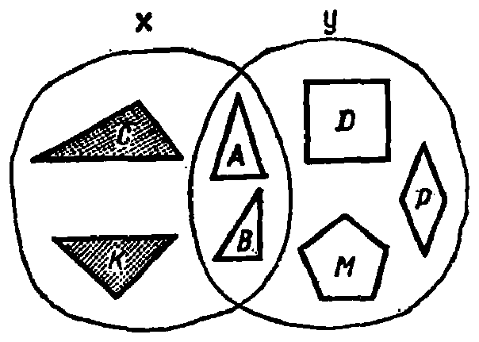
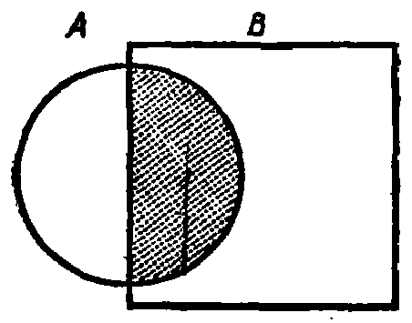
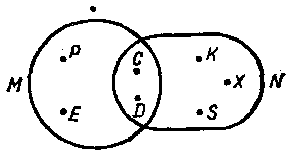

---
{
  "printed_page": 5,
  "book": "5m",
  "page": 14,
  "source": {
    "pdf": "5m 苏联十年制学校教材 数学 五年级.pdf",
    "pdf_sha256": "63de04ad3638091845160482903031cef4728857ad41aac477ffb473222cbe84",
    "pdf_page": 14
  },
  "render": {
    "dpi": 300,
    "w": 1504,
    "h": 2172,
    "sha256": "ab6aa57c849df76a7d545bbc6ae9d670768ff0177dfa9e34e813443b9fe0b6e2"
  },
  "profile": {
    "id": "soviet-cn",
    "sha256": "dad8d974ba16880482f359073263269de8c405ccf8cb17dc4215fad11da44849"
  },
  "schema": "ld-s10y-lesson/page@3",
  "notes": [
    "图 6 之 2） 上方有一枚孤立墨点，非印刷内容，疑为污点，已随裁图保留"
  ],
  "printed_lines": 21,
  "figures": [
    {
      "id": "fig-05",
      "label": "图 5",
      "box": [
        802,
        234,
        580,
        407
      ]
    },
    {
      "id": "fig-06-1",
      "label": "图 6 之 1）",
      "box": [
        279,
        1516,
        428,
        331
      ]
    },
    {
      "id": "fig-06-2",
      "label": "图 6 之 2）",
      "box": [
        814,
        1540,
        552,
        284
      ]
    }
  ],
  "provenance": {
    "cap": "1",
    "normalized": true
  }
}
---

<!-- p cont open -->
两个集合的公共元素是白色
的三角形 $A$ 和 $B$. 白色三角
形的集合是集合 $X$，$Y$ 的公
共部分. 在数学中，用**交集**
来代替“集合的公共部分”.
交集用符号 $\cap$ 表示. $X$ 和 $Y$

<!-- fig 图 5 box 802,234,580,407 -->

<!-- p cont -->
的交集写作 $X \cap Y$. 在上述

<!-- cap 图 5 samerow -->
图 5

<!-- p -->
情况下，$X=\{A, B, C, K\}$，$Y=\{A, B, D, M, P\}$，而 $X \cap Y=$
$\{A, B\}$.

<!-- p -->
**由两个集合的公共元素组成的集合叫作这两个集合的**
**交集.**

<!-- p -->
图 5 中有阴影图形的集合和无阴影图形的集合之间没有
公共元素. 所以这两个集合的交集是空的. 如果两个集合的
交集是空的，就是说，这两个集合不相交.

<!-- p -->
假如 $A$ 和 $B$ 是两个几何图形的点的集合，那么，$A \cap B$ 就
是这两个图形交点的集合. 例如，$A$ 是圆的点的集合(图 6.1)，
$B$ 是正方形的点的集合，那么 $A \cap B$ 就是有阴影的半圆的点
的集合.

<!-- fig 图 6 之 1） box 279,1516,428,331 -->

<!-- fig 图 6 之 2） box 814,1540,552,284 -->

<!-- p -->
1）  2）

<!-- cap 图 6 -->
图 6

<!-- foot -->
· 5 ·
