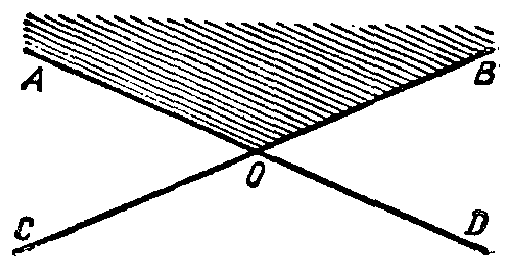

---
{
  "printed_page": 6,
  "book": "5m",
  "page": 15,
  "source": {
    "pdf": "5m 苏联十年制学校教材 数学 五年级.pdf",
    "pdf_sha256": "63de04ad3638091845160482903031cef4728857ad41aac477ffb473222cbe84",
    "pdf_page": 15
  },
  "render": {
    "dpi": 300,
    "w": 1504,
    "h": 2172,
    "sha256": "b135979f600be6017db7307492ac597ac1dca546e5bc6d20a7a289b972a2e6f4"
  },
  "profile": {
    "id": "soviet-cn",
    "sha256": "dad8d974ba16880482f359073263269de8c405ccf8cb17dc4215fad11da44849"
  },
  "schema": "ld-s10y-lesson/page@3",
  "notes": [],
  "printed_lines": 25,
  "figures": [
    {
      "id": "fig-07",
      "label": "图 7",
      "box": [
        793,
        1643,
        488,
        244
      ]
    }
  ],
  "provenance": {
    "cap": "1",
    "normalized": true
  }
}
---

<!-- ex 20 -->
照图 6.2 写出集合 $M$ 和集合 $N$ 以及它们的交集.

<!-- ex 21 -->
写出 12 的约数的集合和 18 的约数的集合. 找出这两个
集合的交集. 12 和 18 的最大公约数是几？

<!-- ex 22 -->
集合 $A$ 由前 10 个 4 的倍数的自然数组成，而集合 $B$ 则由
前 10 个 6 的倍数的自然数组成. 找出 $A$ 和 $B$ 的交集. 4
与 6 的最小公倍数是几？

<!-- ex 23 -->
在射线上标出 3, 8, 5, 10 的对应点 $A, B, C, D$. 哪个线段
是 $AB$ 和 $CD$ 二线段的交集？ 写出答案.

<!-- ex 24 -->
找出组成 “математика” 一词的不同字母的集合和组
成“грамматика”一词的不同字母的集合的交集.

<!-- ex 25 -->
找出偶数集合 $A$ 和奇数集合 $B$ 的交集.

<!-- ex 26 -->
用 $X$ 表示不等式 $5<x<9$ 的自然数解的集合，用 $Y$ 表示
不等式 $2<y<7$ 的自然数解的集合. 在大括号内写出 $X$
和 $Y$ 的交集.

<!-- exhead -->
复习题

<!-- ex 27 -->
“在长满青苔的沼泽地里，鲜红的蔓越桔的果实成串地散
落在土墩上”，从这个句子的单词的集合中选出子集：
1）名词；  3）形容词；
2）动词；  4）数词.

<!-- ex 28 -->
写出集合 $\{1, 2, 3\}$ 的全部子
集.

<!-- ex 29 open -->
图 7 中 $AOB$ 角的点的集合
涂有阴影. 这个点的集合

<!-- fig 图 7 box 793,1643,488,244 -->

<!-- ex 29 cont open -->
是两个平角的点的集合的子

<!-- cap 图 7 samerow -->
图 7

<!-- foot -->
· 6 ·
