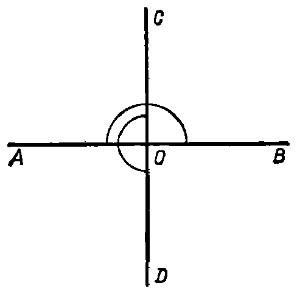

---
{
  "printed_page": 7,
  "book": "5m",
  "page": 16,
  "source": {
    "pdf": "5m 苏联十年制学校教材 数学 五年级.pdf",
    "pdf_sha256": "63de04ad3638091845160482903031cef4728857ad41aac477ffb473222cbe84",
    "pdf_page": 16
  },
  "render": {
    "dpi": 300,
    "w": 1504,
    "h": 2172,
    "sha256": "a1e674473cfdcd6bc2c2052048990bf62c419fa23906ada3f89b5d2ba75f65ae"
  },
  "profile": {
    "id": "soviet-cn",
    "sha256": "dad8d974ba16880482f359073263269de8c405ccf8cb17dc4215fad11da44849"
  },
  "schema": "ld-page2class/page@3",
  "notes": [],
  "printed_lines": 25,
  "figures": [
    {
      "id": "fig-08",
      "label": "图 8",
      "box": [
        894,
        1428,
        464,
        459
      ]
    }
  ],
  "provenance": {
    "cap": "1",
    "normalized": true
  }
}
---

<!-- ex 29 cont -->
集. 指出这两个平角并说出名称.

<!-- ex 30 -->
某工人七月份收入 140 卢布. 八月份他掌握了先进的劳
动方法，提高了生产效率，收入增加了 17%. 这个工人
在八月份收入多少卢布？

<!-- ex 31 -->
决定烘干 150 公斤樱桃. 烘干时，樱桃的重量减轻 80%.
烘干后得樱桃多少公斤？

<!-- ex 32 -->
计算：
1）$4.76 + 3.24 : 0.8 + (0.623 + 1.12 \cdot 3.8) : 4.1$；
2）$3.92 + 4.41 : 0.7 + (1.59 + 1.21 \cdot 2.6) : 3.2$.

<!-- ex 33 -->
解方程：
1）$3.7 \cdot (x - 2.5) = 186.85$；
2）$(y + 3.8) \cdot 2.9 = 60.61$.

<!-- exhead -->
家庭作业题

<!-- ex 34 -->
假设：
1）$A$={5, 10, 15, 20, 25}，  $B$={15, 20, 25, 30, 35}；
2）$A$={а, б, в, г, д, е}，  $B$={а, в, г, е}，
在大括号内写出 $A$ 和 $B$ 的交
集.

<!-- ex 35 -->
图 8 中用圆弧标出平角 $AOB$
和 $COD$. 写出这两个角的
交集是哪个角.

<!-- ex 36 open -->
设：
1）$X=20$，$Y=30$；

<!-- fig 图 8 box 894,1428,464,459 -->

<!-- ex 36 cont open -->
2）$X=36$，$Y=24$，

<!-- cap 图 8 samerow -->
图 8

<!-- foot -->
· 7 ·
