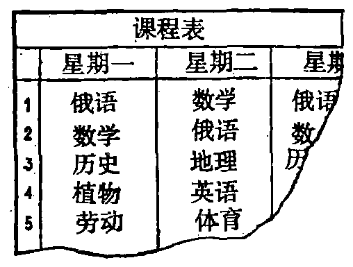
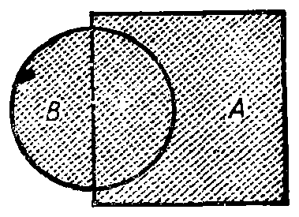

---
{
  "printed_page": 8,
  "book": "5m",
  "page": 17,
  "source": {
    "pdf": "5m 苏联十年制学校教材 数学 五年级.pdf",
    "pdf_sha256": "63de04ad3638091845160482903031cef4728857ad41aac477ffb473222cbe84",
    "pdf_page": 17
  },
  "render": {
    "dpi": 300,
    "w": 1504,
    "h": 2172,
    "sha256": "5e6106ec562e1d1dd2a8348b29abceffad9170330d17821b3a2c6d5bb3849419"
  },
  "profile": {
    "id": "soviet-cn",
    "sha256": "dad8d974ba16880482f359073263269de8c405ccf8cb17dc4215fad11da44849"
  },
  "schema": "ld-s10y-lesson/page@3",
  "notes": [
    "课程表右下角被撕纸状缺口截断，第三列「星期三」只余「俄语／数／历」残字，照原样裁图，不补全"
  ],
  "printed_lines": 25,
  "figures": [
    {
      "id": "tbl-p0017-01",
      "label": "课程表",
      "box": [
        780,
        875,
        484,
        361
      ]
    },
    {
      "id": "fig-09",
      "label": "图 9",
      "box": [
        851,
        1330,
        355,
        251
      ]
    }
  ],
  "provenance": {
    "cap": "1",
    "normalized": true
  }
}
---

<!-- ex 36 cont -->
写出数 $X$ 的约数的集合和数 $Y$ 的约数的集合. 找出这两
个集合的交集.

<!-- ex 37 -->
集合 $M$ 由前 10 个 3 的倍数的自然数组成，集合 $K$ 由前 10
个 5 的倍数的自然数组成. 找出 $M$ 和 $K$ 的交集.

<!-- ex 38 -->
求下列各式的值：
1）$18.305 : 0.7 - 0.0368 : 0.4 + 0.492 : 1.2$；
2）$(21.62 \cdot 3.5 - 52.08 : 8.4) \cdot 0.5$.

<!-- h3 -->
3. 并集

<!-- p open -->
右面列有星期一和星期二

<!-- fig 课程表 box 780,875,484,361 -->

<!-- p cont open -->
的课程表. 用 $A$ 表示星期一的
课程的集合. 用 $B$ 表示星期二
的课程的集合. 在这两天里学
习的课程计有：{俄语、数学、历
史、植物、劳动、地理、英语、体
育}. 所得课程的集合叫做集
合 $A$={俄语，数学，植物，历

<!-- fig 图 9 box 851,1330,355,251 -->

<!-- p cont open -->
史，劳动}和 $B$={数学，俄语，
地理，英语，体育}的**并集**. 集
合 $A$ 和 $B$ 的并集写作 $A \cup B$. 就
是说，$A \cup B$={俄语，数学，历

<!-- cap 图 9 samerow -->
图 9

<!-- p cont -->
史，植物，劳动，地理，英语，体育}.

<!-- p -->
**由至少属于两个集合之一的元素组成的集合叫做这两个**
**集合的并集.**

<!-- p open -->
如果 $A$ 是正方形的点的集合(图 9)，$B$ 是圆的点的集合，

<!-- foot -->
· 8 ·
