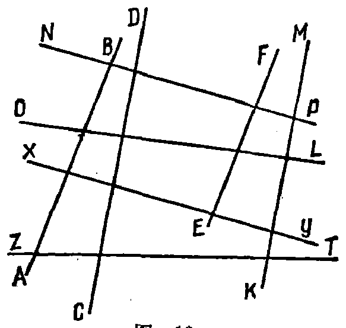

---
{
  "printed_page": 11,
  "book": "5m",
  "page": 20,
  "source": {
    "pdf": "5m 苏联十年制学校教材 数学 五年级.pdf",
    "pdf_sha256": "63de04ad3638091845160482903031cef4728857ad41aac477ffb473222cbe84",
    "pdf_page": 20
  },
  "render": {
    "dpi": 300,
    "w": 1504,
    "h": 2172,
    "sha256": "514b58e15c6972f781976fa8d07029f56e417783485b6934096f3e6e33fe2872"
  },
  "profile": {
    "id": "soviet-cn",
    "sha256": "dad8d974ba16880482f359073263269de8c405ccf8cb17dc4215fad11da44849"
  },
  "schema": "ld-page2class/page@3",
  "notes": [],
  "printed_lines": 17,
  "figures": [
    {
      "id": "fig-13",
      "label": "图 13",
      "box": [
        525,
        925,
        559,
        529
      ]
    }
  ],
  "provenance": {
    "cap": "1",
    "normalized": true
  }
}
---

<!-- p cont -->
所示，先靠紧直线 $m$ 放一三角板，再靠紧三角板的另一边放一
直尺. 然后沿直尺移动三角板并作平行于直线 $m$ 的直线 $n$.
这样就可以过平面上的任一点作直线 $m$ 的平行线.

<!-- ex 49 -->
求证长方形的对边平行.

<!-- ex 50 -->
作 5 条互相平行的直线.

<!-- ex 51 -->
作直线 $l$ 并取线外两点 $M$ 和 $K$，过点 $M$ 和 $K$ 作平行于 $l$
的两条直线.

<!-- ex 52 -->
作三角形并过每一顶点作一条平行于对边的直线.

<!-- ex 53 -->
利用直尺和三角板找出图 13 中的每对平行线.

<!-- fig 图 13 box 525,925,559,529 -->

<!-- cap 图 13 -->
图 13

<!-- exhead -->
复习题

<!-- ex 54 -->
集合 $A$ 由前四个 3 的倍数的自然数组成，集合 $B$ 由前三
个 6 的倍数的自然数组成. 在大括号内写出 $A$、$B$ 的交
集和并集.

<!-- ex 55 -->
$X$ 是不等式 $7 \leqslant X \leqslant 12$ 的自然数解的集合；$Y$ 是不等式
$5 \leqslant Y \leqslant 8$ 的自然数解的集合.

<!-- foot -->
· 11 ·
