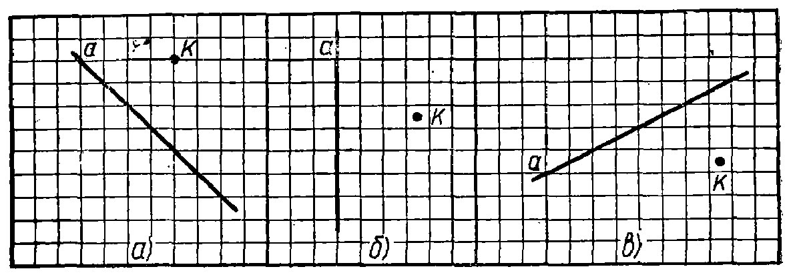
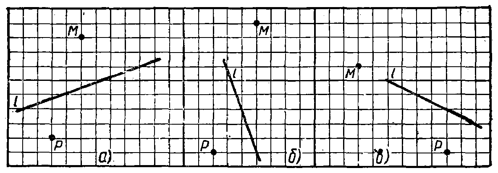

---
{
  "schema": "ld-s10y-lesson/page@3",
  "book": "5m",
  "page": 22,
  "printed_page": 13,
  "source": {
    "pdf": "5m 苏联十年制学校教材 数学 五年级.pdf",
    "pdf_sha256": "63de04ad3638091845160482903031cef4728857ad41aac477ffb473222cbe84",
    "pdf_page": 22
  },
  "render": {
    "dpi": 300,
    "w": 1504,
    "h": 2172,
    "sha256": "04a2ee656c7a22e242ab68964717ca13ccdd4d6934ead674346db97e2912dcfd"
  },
  "profile": {
    "id": "soviet-cn",
    "sha256": "dad8d974ba16880482f359073263269de8c405ccf8cb17dc4215fad11da44849"
  },
  "notes": [],
  "printed_lines": 13,
  "figures": [
    {
      "id": "fig-14",
      "label": "图 14",
      "box": [
        226,
        442,
        1161,
        391
      ]
    },
    {
      "id": "fig-15",
      "label": "图 15",
      "box": [
        220,
        1093,
        1162,
        391
      ]
    }
  ],
  "provenance": {
    "cap": "1",
    "normalized": true
  }
}
---

<!-- exhead -->
家庭作业题

<!-- ex 62 -->
把图 14 画在练习本上. 过 $K$ 点引一直线平行于直线 $a$.

<!-- fig 图 14 box 226,442,1161,391 -->

<!-- cap 图 14 -->
图 14

<!-- ex 63 -->
把图 15 画在练习本上. 过 $M$ 和 $P$ 两点向直线 $l$ 作两条
垂线.

<!-- fig 图 15 box 220,1093,1162,391 -->

<!-- cap 图 15 -->
图 15

<!-- ex 64 -->
有两个行人从两个村庄同时出发相向而行，于 4 小时后
相遇. 两村相距 36 公里. 一个行人的速度为 4 公里/小
时. 求另一个行人的速度.

<!-- ex 65 -->
在三个箱子中共装樱桃 76 公斤. 第二箱装的樱桃是第
一箱的 2 倍，第三箱比第一箱多 8 公斤. 每箱各装樱桃
多少公斤？

<!-- foot -->
· 13 ·
