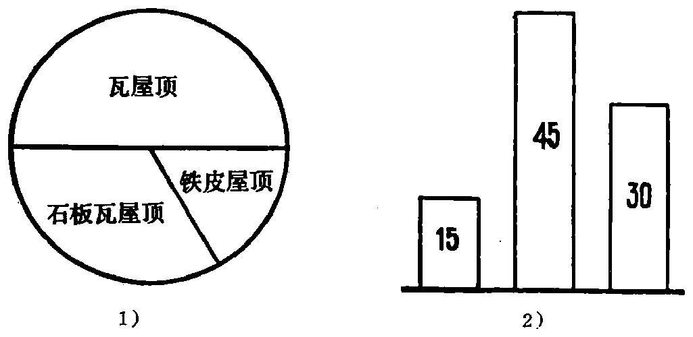

---
{
  "schema": "ld-s10y-lesson/page@3",
  "book": "5m",
  "page": 23,
  "printed_page": 14,
  "source": {
    "pdf": "5m 苏联十年制学校教材 数学 五年级.pdf",
    "pdf_sha256": "63de04ad3638091845160482903031cef4728857ad41aac477ffb473222cbe84",
    "pdf_page": 23
  },
  "render": {
    "dpi": 300,
    "w": 1504,
    "h": 2172,
    "sha256": "4a89863a1efd437f6543230dd70049ced399b9f699dd50cb5fd02fbbf334fba9"
  },
  "profile": {
    "id": "soviet-cn",
    "sha256": "dad8d974ba16880482f359073263269de8c405ccf8cb17dc4215fad11da44849"
  },
  "notes": [],
  "printed_lines": 18,
  "figures": [
    {
      "id": "fig-16",
      "label": "图 16",
      "box": [
        180,
        1161,
        1001,
        476
      ]
    }
  ],
  "provenance": {
    "cap": "1",
    "normalized": true
  }
}
---

<!-- ex 66 -->
解方程：
1) $13200:x-2180=20$；
2) $y:320-31=79$.

<!-- h3 -->
5. 分类

<!-- p -->
某村有 90 幢房屋. 其中 15 幢是铁皮屋顶，45 幢是瓦屋
顶，30 幢为石板瓦屋顶. 全部房屋的集合 $X$ 由三个子集——
铁皮屋顶房屋的集合 $A$、瓦屋顶房屋的集合 $B$ 和石板瓦屋顶
房屋的集合 $C$ 组成. $X=A\cup B\cup C$. 在 $A$，$B$，$C$ 三个集合中，
任何两个之间都没有公共元素：$A\cap B=\phi$，$A\cap C=\phi$ 和 $B\cap C$
$=\phi$. 在这种情况下就说：房屋的集合 $X$ 分成三类（铁皮屋
顶的、瓦屋顶的和石板瓦屋顶的）.

<!-- p open -->
用圆形图（图 16.1）表示每类房屋的数量. 也可以用条形

<!-- fig 图 16 box 180,1161,1001,476 -->

<!-- cap 图 16 -->
图 16

<!-- p cont open -->
图（图 16.2）表示每类房屋的数量. 为此要画三个柱，每个柱
高的毫米数分别等于三种房屋的数量. 第一个柱高 15 毫米，
第二个 45 毫米，第三个 30 毫米.
把集合划分成不同的类别叫做分类. 在分类时，不能把

<!-- foot -->
· 14 ·
