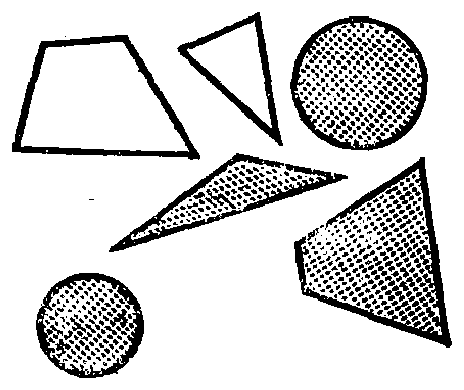
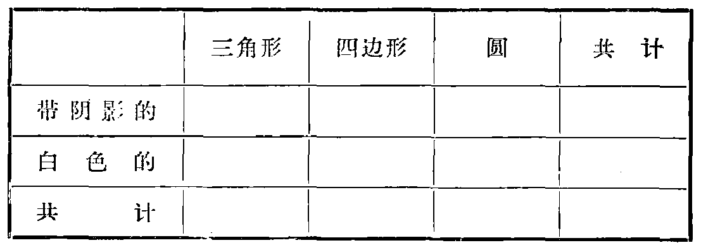

---
{
  "schema": "ld-s10y-lesson/page@3",
  "book": "5m",
  "page": 24,
  "printed_page": 15,
  "source": {
    "pdf": "5m 苏联十年制学校教材 数学 五年级.pdf",
    "pdf_sha256": "63de04ad3638091845160482903031cef4728857ad41aac477ffb473222cbe84",
    "pdf_page": 24
  },
  "render": {
    "dpi": 300,
    "w": 1504,
    "h": 2172,
    "sha256": "70ddb928d3685d994206c778a55ee812d8c1cd5aff2f6e2fb6d3455b8ebd5c2e"
  },
  "profile": {
    "id": "soviet-cn",
    "sha256": "dad8d974ba16880482f359073263269de8c405ccf8cb17dc4215fad11da44849"
  },
  "notes": [],
  "printed_lines": 18,
  "figures": [
    {
      "id": "fig-17",
      "label": "图 17",
      "box": [
        937,
        656,
        440,
        366
      ]
    },
    {
      "id": "tbl-p0024-02",
      "label": "表格",
      "box": [
        262,
        1213,
        1083,
        372
      ]
    }
  ],
  "provenance": {
    "cap": "1",
    "normalized": true
  }
}
---

<!-- p cont -->
同一个元素分在不同的两类里，也不得漏掉一个元素. 应该
把每个元素都分在它自己的一类里.

<!-- ex 67 -->
把 1，2，3，4，5，6，7，8，9，10，11，12，13，14，15，16，17，18，
19，20 等数分成三类. 第一类包括 3 的倍数，第二类包
括用 3 除余 1 的各数，第三类包括用 3 除余 2 的各数.

<!-- ex 68 -->
图 17 中的图形的集合是不是
可以分成：1) 两类——三角
形和四边形；2) 三类——三
角形、四边形和带阴影图形；
3) 三类——三角形、四边形
和圆；4) 两类——带阴影图
形和白色图形？

<!-- fig 图 17 box 937,656,440,366 -->

<!-- cap 图 17 samerow -->
图 17

<!-- ex 69 open -->
按图 17 填写下表：

<!-- fig 表格 box 262,1213,1083,372 -->

<!-- ex 69 cont -->
作条形图，表示出三角形、四边形和圆的数量（图 17）.

<!-- exhead -->
复习题

<!-- ex 70 -->
设 $|AB|=5.6$ 厘米，$\widehat{A}=40^\circ$，$\widehat{B}=65^\circ$，作三角形 $ABC$，再过
顶点 $C$ 作 $AB$ 边的平行线.

<!-- foot -->
· 15 ·
