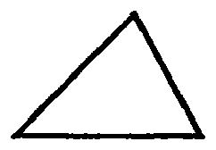
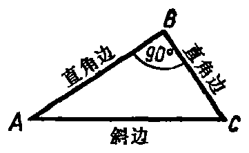
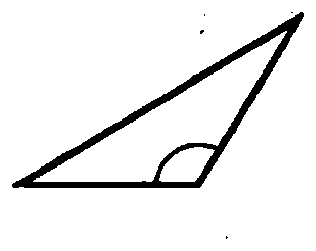
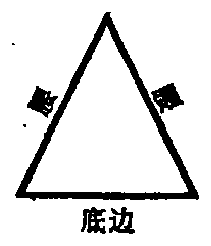

---
{
  "schema": "ld-page2class/page@3",
  "book": "5m",
  "page": 26,
  "printed_page": 17,
  "source": {
    "pdf": "5m 苏联十年制学校教材 数学 五年级.pdf",
    "pdf_sha256": "63de04ad3638091845160482903031cef4728857ad41aac477ffb473222cbe84",
    "pdf_page": 26
  },
  "render": {
    "dpi": 300,
    "w": 1504,
    "h": 2172,
    "sha256": "d84dac05b10ce844608cf985014c925d0dc4a6c11837bc6c7bf8fde720e87d70"
  },
  "profile": {
    "id": "soviet-cn",
    "sha256": "dad8d974ba16880482f359073263269de8c405ccf8cb17dc4215fad11da44849"
  },
  "notes": [],
  "printed_lines": 20,
  "figures": [
    {
      "id": "fig-19",
      "label": "图 19",
      "box": [
        183,
        917,
        218,
        144
      ]
    },
    {
      "id": "fig-20",
      "label": "图 20",
      "box": [
        442,
        895,
        337,
        198
      ]
    },
    {
      "id": "fig-21",
      "label": "图 21",
      "box": [
        834,
        883,
        292,
        227
      ]
    },
    {
      "id": "fig-22",
      "label": "图 22",
      "box": [
        1157,
        874,
        187,
        222
      ]
    }
  ],
  "provenance": {
    "cap": "1",
    "normalized": true
  }
}
---

<!-- h3 -->
6. 三角形的分类

<!-- p -->
三角形可按它的角的大小进行分类.
三角形中只能有一个直角或一个钝角，否则，三个内角的
和就要大于 $180^\circ$. 所以各种三角形的集合可以按角的大小
分成三类：
1) 锐角三角形，三个角都是锐角（图 19）；
2) 直角三角形，有一个直角（图 20）；
3) 钝角三角形，有一个钝角（图 21）.

<!-- fig 图 19 box 183,917,218,144 -->

<!-- cap 图 19 -->
图 19

<!-- fig 图 20 box 442,895,337,198 -->

<!-- cap 图 20 samerow -->
图 20

<!-- fig 图 21 box 834,883,292,227 -->

<!-- cap 图 21 samerow -->
图 21

<!-- fig 图 22 box 1157,874,187,222 -->

<!-- cap 图 22 samerow -->
图 22

<!-- p -->
直角三角形的三个边有专门的名称，如图 20 所示.
三角形也可以按边长分类. 如果三角形中有两边相等，则
把这种三角形叫做等腰三角形. 其余所有三角形（三个边没
有等长的）构成由不等边三角形组成的子集.
三角形的集合分为二类：等腰三角形的集合和不等边
三角形的集合.
等腰三角形的三个边有专门名称，如图 22 所示.
三边相等的三角形叫做等边三角形. 等边三角形的集合
是等腰三角形的集合的子集.

<!-- ex 76 -->
图 23 中画有若干个三角形. 按照这个图填写下表：

<!-- foot -->
· 17 ·
