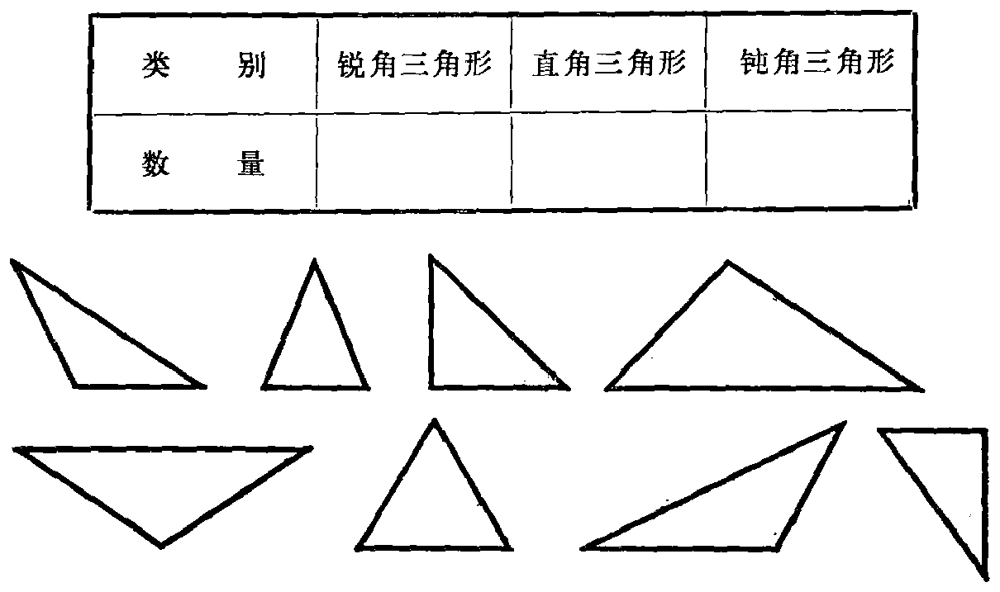

---
{
  "schema": "ld-s10y-lesson/page@3",
  "book": "5m",
  "page": 27,
  "printed_page": 18,
  "source": {
    "pdf": "5m 苏联十年制学校教材 数学 五年级.pdf",
    "pdf_sha256": "63de04ad3638091845160482903031cef4728857ad41aac477ffb473222cbe84",
    "pdf_page": 27
  },
  "render": {
    "dpi": 300,
    "w": 1504,
    "h": 2172,
    "sha256": "2e2da5008167c068b244033b749223afc4227f209f86d23c03f381052cae64d0"
  },
  "profile": {
    "id": "soviet-cn",
    "sha256": "dad8d974ba16880482f359073263269de8c405ccf8cb17dc4215fad11da44849"
  },
  "notes": [],
  "printed_lines": 15,
  "figures": [
    {
      "id": "fig-23",
      "label": "图 23",
      "box": [
        180,
        220,
        1186,
        693
      ]
    }
  ],
  "provenance": {
    "cap": "1",
    "normalized": true
  }
}
---

<!-- fig 图 23 box 180,220,1186,693 -->

<!-- cap 图 23 -->
图 23

<!-- ex 77 -->
作长方形 $ABCD$，它的长、宽分别为 5 厘米和 3 厘米. 引
线段 $AC$ 与 $BD$（长方形的对角线）. 这个长方形被分成
几个三角形？其中哪些是锐角三角形，哪些是钝角三角
形？再把所得的每个三角形分成二个直角三角形.

<!-- ex 78 -->
作正方形并把它分成两个直角三角形.

<!-- ex 79 -->
在圆心为 $O$ 的圆中，引半径 $OA$ 和 $OB$，使它们的夹角等
于 $140^\circ$. 判定三角形 $AOB$ 的类型.

<!-- ex 80 -->
以 $K$ 点为圆心，作半径长 3 厘米的圆. 在圆周上取点 $M$
和 $T$，使它们之间的距离为 3 厘米. 用线段联结点 $K$、$M$
和 $T$. 证明，三角形 $MKT$ 为等边三角形.

<!-- exhead -->
复习题

<!-- ex 81 open -->
把 13 和 23 之间的自然数的集合分为两个不相交的子
集，其中一个子集包括 7 的倍数，另一个子集包括 7 的倍

<!-- foot -->
· 18 ·
