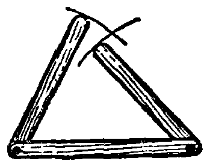
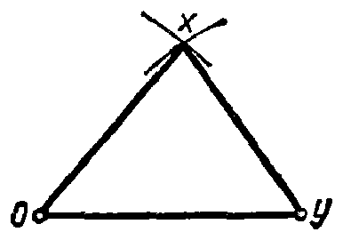
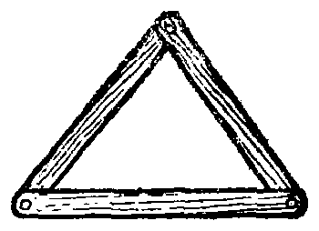
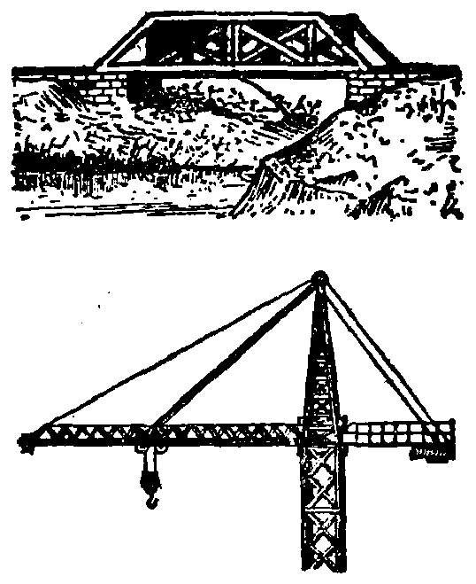

---
{
  "schema": "ld-s10y-lesson/page@3",
  "book": "5m",
  "page": 30,
  "printed_page": 21,
  "source": {
    "pdf": "5m 苏联十年制学校教材 数学 五年级.pdf",
    "pdf_sha256": "63de04ad3638091845160482903031cef4728857ad41aac477ffb473222cbe84",
    "pdf_page": 30
  },
  "render": {
    "dpi": 300,
    "w": 1504,
    "h": 2172,
    "sha256": "f2d56a2f5c59dff89d3dda45c58c850761ad79dcd56e766c71cb90b2e074ab2c"
  },
  "profile": {
    "id": "soviet-cn",
    "sha256": "dad8d974ba16880482f359073263269de8c405ccf8cb17dc4215fad11da44849"
  },
  "notes": [],
  "printed_lines": 21,
  "figures": [
    {
      "id": "fig-24",
      "label": "图 24",
      "box": [
        193,
        532,
        325,
        254
      ]
    },
    {
      "id": "fig-25",
      "label": "图 25",
      "box": [
        590,
        537,
        362,
        246
      ]
    },
    {
      "id": "fig-26",
      "label": "图 26",
      "box": [
        1043,
        553,
        326,
        230
      ]
    },
    {
      "id": "fig-27",
      "label": "图 27",
      "box": [
        837,
        1309,
        514,
        635
      ]
    }
  ],
  "provenance": {
    "cap": "1",
    "normalized": true
  }
}
---

<!-- h3 -->
7. 已知三边作三角形

<!-- p -->
问题. 用直尺和圆规作 $\triangle XOY$，使 $|XO|=3.5$ 厘米，
$|OY|=4$ 厘米，$|YX|=3$ 厘米.

<!-- fig 图 24 box 193,532,325,254 -->

<!-- cap 图 24 -->
图 24

<!-- fig 图 25 box 590,537,362,246 -->

<!-- cap 图 25 samerow -->
图 25

<!-- fig 图 26 box 1043,553,326,230 -->

<!-- cap 图 26 samerow -->
图 26

<!-- p -->
假如用活动接头把三根各长 3 厘米、3.5 厘米和 4 厘米的
木条连接起来，如图 24 所示，转动两边的两根木条，可以构成
一个三角形. 可以用圆规来代替旋转木条.

<!-- p -->
首先作长 4 厘米的线段 $OY$（图 25）. 然后划两个圆弧：
一个弧的圆心为 $O$，半径长 3.5 厘米，另一个弧的圆心为 $Y$，半
径长 3 厘米. 交点 $X$ 是三角形的第三顶点. 联结 $X$ 和 $O$、$Y$，
即得 $\triangle XOY$.

<!-- p -->
假如按图 26 所示联结三根
木条，那么只要木条不伸长，不
缩短，不弯曲，三角形的形状就不
能改变. 所以说三角形是稳定的
图形. 在实践中常常用到三角形
的这个特性（图 27）.

<!-- fig 图 27 box 837,1309,514,635 -->

<!-- cap 图 27 samerow -->
图 27

<!-- p open -->
作三角形用的线段的长度不
能随意给定. 在图 28 中，两根短
木条的长度的和小于长木条的长

<!-- foot -->
· 21 ·
