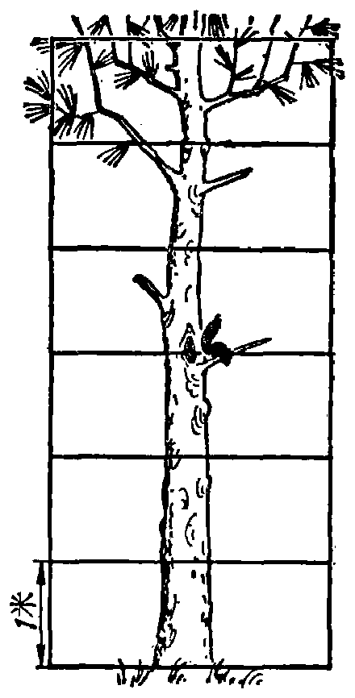
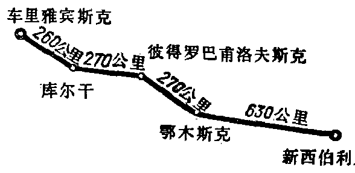

---
{
  "schema": "ld-s10y-lesson/page@3",
  "book": "5m",
  "page": 33,
  "printed_page": 24,
  "source": {
    "pdf": "5m 苏联十年制学校教材 数学 五年级.pdf",
    "pdf_sha256": "63de04ad3638091845160482903031cef4728857ad41aac477ffb473222cbe84",
    "pdf_page": 33
  },
  "render": {
    "dpi": 300,
    "w": 1504,
    "h": 2172,
    "sha256": "27bfc996c570daaa9eeac8849f6f13d59a9ac20e65f0ff60eaca0a0a060b4dc8"
  },
  "profile": {
    "id": "soviet-cn",
    "sha256": "dad8d974ba16880482f359073263269de8c405ccf8cb17dc4215fad11da44849"
  },
  "notes": [],
  "printed_lines": 23,
  "figures": [
    {
      "id": "fig-29",
      "label": "图 29",
      "box": [
        208,
        318,
        416,
        842
      ]
    },
    {
      "id": "fig-30",
      "label": "图 30",
      "box": [
        684,
        894,
        564,
        263
      ]
    }
  ],
  "provenance": {
    "cap": "1",
    "normalized": true
  }
}
---

<!-- ex 106 -->
为了确定松鼠在树上的位置，只知道它和树洞的距
离是不够的，还必须了解它在
树洞的上边还是下边.
如果松鼠在：
1) 树洞上方 2 米；
2) 树洞下方 3 米；
3) 树洞下方 1.5 米；
4) 树洞上方 2.5 米，
在图 29 上指出松鼠的位置.

<!-- fig 图 29 box 208,318,416,842 -->

<!-- cap 图 29 -->
图 29

<!-- fig 图 30 box 684,894,564,263 -->

<!-- cap 图 30 -->
图 30

<!-- ex 107 -->
一列火车从彼得罗巴甫洛夫斯克车站驶出（图 30），行
速 90 公里/小时. 三小时后，火车将到达那个城市？

<!-- ex 108 open -->
为了确定火车在铁路上的位置，只知道它和彼得罗巴甫
洛夫斯克车站之间的距离是不够的，还必须了解火车开
往哪里，是开往新西伯利亚，还是开向车里雅宾斯克？如
果它是开往新西伯利亚城，那么三小时以后它将抵达鄂
木斯克车站. 如果是开往车里雅宾斯克，就将到达库尔
干. 按图 30 说明：
1) 如果火车开往新西伯利亚，10 小时后，火车将在哪
里；
2) 如果火车开往车里雅宾斯克，5 小时后，火车将在哪

<!-- foot -->
· 24 ·
