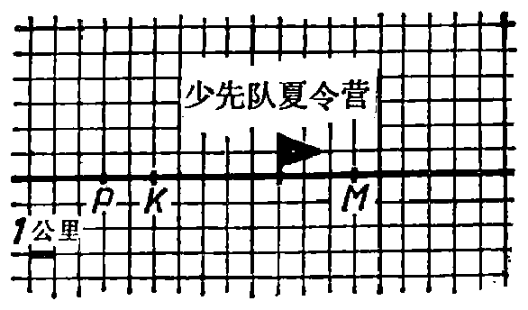

---
{
  "schema": "ld-s10y-lesson/page@3",
  "book": "5m",
  "page": 34,
  "printed_page": 25,
  "source": {
    "pdf": "5m 苏联十年制学校教材 数学 五年级.pdf",
    "pdf_sha256": "63de04ad3638091845160482903031cef4728857ad41aac477ffb473222cbe84",
    "pdf_page": 34
  },
  "render": {
    "dpi": 300,
    "w": 1504,
    "h": 2172,
    "sha256": "867a3597a9f91b900a284589b72e9a901c6aa982489bba658213525dd319d0c9"
  },
  "profile": {
    "id": "soviet-cn",
    "sha256": "dad8d974ba16880482f359073263269de8c405ccf8cb17dc4215fad11da44849"
  },
  "notes": [],
  "printed_lines": 24,
  "figures": [
    {
      "id": "fig-31",
      "label": "图 31",
      "box": [
        813,
        262,
        562,
        320
      ]
    },
    {
      "id": "fig-32",
      "label": "图 32",
      "box": [
        301,
        1618,
        1000,
        51
      ]
    }
  ],
  "provenance": {
    "cap": "1",
    "normalized": true
  }
}
---

<!-- ex 108 cont -->
里？

<!-- ex 109 -->
少先队中队从少先队夏
令营出发沿公路前进
（图 31）. 指出：
1) 如果行速是 3 公里/
小时，3 小时后这个
中队将在哪里？
2) 如果行速是 4 公里/小时，2 小时后这个中队将在哪
里？
为使以上每个问题只有一个答案，还必须知道什么条
件？

<!-- fig 图 31 box 813,262,562,320 -->

<!-- cap 图 31 samerow -->
图 31

<!-- ex 110 -->
少先队员在行军途中，在 $K$、$M$、$P$ 三个地方留下了感谢
信（图 31）. 留信的地点在夏令营的什么位置上？

<!-- ex 111 -->
从左向右作一条直线，在直线上取点 $O$. 如果知道：
1) $A$ 在 $O$ 右边第 6 个格上；2) $B$ 在 $O$ 左边第 5.5 个格
上；3) $C$ 在 $O$ 右边第 7.5 个格上；4) $K$ 在 $O$ 左边第 2
个格上，在这条直线上标出点 $A$、$B$、$C$、$K$.

<!-- ex 112 -->
以厘米度量从点 $O$（图 32）到点 $C$ 和点 $P$ 的距离. 在这
条直线上，这两个点各在关于 $O$ 点的什么位置上？

<!-- fig 图 32 box 301,1618,1000,51 -->

<!-- cap 图 32 -->
图 32

<!-- exhead -->
复习题

<!-- ex 113 open -->
两个灯塔间的距离为 5 公里. 巡洋舰距离一个灯塔 6
公里，距离另一个灯塔 7 公里. 在练习本上按 $1:100\,000$

<!-- foot -->
· 25 ·
