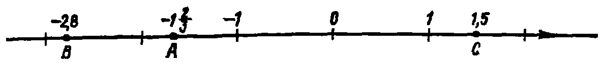
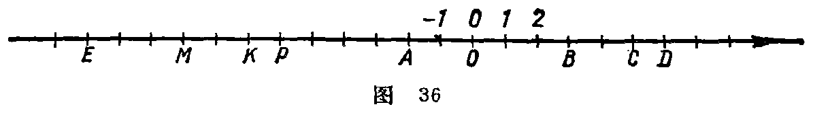
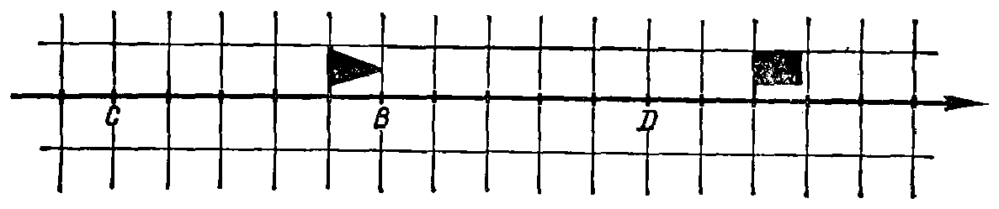

---
{
  "schema": "ld-s10y-lesson/page@3",
  "book": "5m",
  "page": 38,
  "printed_page": 29,
  "source": {
    "pdf": "5m 苏联十年制学校教材 数学 五年级.pdf",
    "pdf_sha256": "63de04ad3638091845160482903031cef4728857ad41aac477ffb473222cbe84",
    "pdf_page": 38
  },
  "render": {
    "dpi": 300,
    "w": 1504,
    "h": 2172,
    "sha256": "985e9061c3904eff053d50caadeb7c85985bab69f79d05d552705faf146fed26"
  },
  "profile": {
    "id": "soviet-cn",
    "sha256": "dad8d974ba16880482f359073263269de8c405ccf8cb17dc4215fad11da44849"
  },
  "notes": [],
  "printed_lines": 17,
  "figures": [
    {
      "id": "fig-35",
      "label": "图 35",
      "box": [
        183,
        235,
        1164,
        105
      ]
    },
    {
      "id": "fig-36",
      "label": "图 36",
      "box": [
        189,
        1031,
        1171,
        144
      ]
    },
    {
      "id": "fig-37",
      "label": "图 37",
      "box": [
        192,
        1560,
        1163,
        225
      ]
    }
  ],
  "provenance": {
    "cap": "1",
    "normalized": true
  }
}
---

<!-- fig 图 35 box 183,235,1164,105 -->

<!-- cap 图 35 -->
图 35

<!-- p -->
规定有原点、单位线段和方向的直线叫做数轴. 在历史
课中我们遇到过数轴. 不过在那里叫做“年代表”.

<!-- p -->
温度计上的刻度表示不同的数—正数、负数和零. 原点
相当于冰的融点. 在 $100^\circ\mathrm{C}$ 时，水沸腾，在 $-39^\circ\mathrm{C}$ 时，水银
冻结.

<!-- ex 126 -->
点 $O$ 为原点. 写出点 $O$、$A$、$B$、$C$、$D$、$P$、$K$、$M$、$E$ 等的坐
标（图 36）.

<!-- fig 图 36 box 189,1031,1171,144 -->

<!-- cap 图 36 -->
图 36

<!-- ex 127 -->
在数轴上标出下列各点：$A(1)$，$B(8.3)$，$C(-6)$，$D(6)$，
$M(-2.4)$，$K(2.4)$.

<!-- ex 128 -->
三角形小旗位于坐标为 $-2$ 的点上，长方形的小旗在坐
标为 $2$ 的点上（图 37）. 标出原点和单位线段. 写出点
$B$、$C$、$D$ 的坐标.

<!-- fig 图 37 box 192,1560,1163,225 -->

<!-- cap 图 37 -->
图 37

<!-- ex 129 open -->
设：$x=-7,3.3,-5.2,-1,2,-1.8,\frac{5}{3},-\frac{7}{2}$ 时，在数轴

<!-- foot -->
· 29 ·
