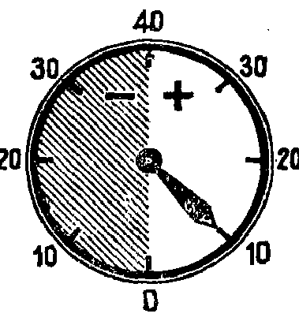

---
{
  "schema": "ld-s10y-lesson/page@3",
  "book": "5m",
  "page": 40,
  "printed_page": 31,
  "source": {
    "pdf": "5m 苏联十年制学校教材 数学 五年级.pdf",
    "pdf_sha256": "63de04ad3638091845160482903031cef4728857ad41aac477ffb473222cbe84",
    "pdf_page": 40
  },
  "render": {
    "dpi": 300,
    "w": 1504,
    "h": 2172,
    "sha256": "28adee32d87856f8b241930da5b3e5056f4f707b0d5725b6a1afcfbdaf7a9109"
  },
  "profile": {
    "id": "soviet-cn",
    "sha256": "dad8d974ba16880482f359073263269de8c405ccf8cb17dc4215fad11da44849"
  },
  "notes": [],
  "printed_lines": 24,
  "figures": [
    {
      "id": "fig-39",
      "label": "图 39",
      "box": [
        992,
        228,
        355,
        383
      ]
    }
  ],
  "provenance": {
    "cap": "1",
    "normalized": true
  }
}
---

<!-- ex 134 cont -->
1) $-12^\circ\mathrm{C}$；2) $-11^\circ\mathrm{C}$；
3) $-7^\circ\mathrm{C}$；4) $3^\circ\mathrm{C}$；
5) $-8.5^\circ\mathrm{C}$；6) $7.3^\circ\mathrm{C}$.

<!-- ex 135 -->
在莫斯科大学的建筑物上安装
有一个带指针的温度计. 这个温
度计指示的温度是多少度（图
39）？

<!-- fig 图 39 box 992,228,355,383 -->

<!-- cap 图 39 samerow -->
图 39

<!-- ex 136 -->
从集合 $\{-1.2,\frac{3}{5},-\frac{12}{4},0,6,-3\frac{7}{8},7.2,-10,8\}$ 中选
出以下子集：1) 负数；2) 正数；3) 自然数.

<!-- exhead -->
复习题

<!-- ex 137 -->
说出等边三角形集合和等腰三角形集合的并集.

<!-- ex 138 -->
作用在每平方厘米地球表面的空气柱的质量为 1.033 公
斤. 作用于每平方公里上的空气柱的质量是多少？计算
亚速海上的空气柱的质量，该海的面积为 38 000 平方
公里.

<!-- ex 139 -->
在 $37*5$ 的写法中，用什么数字代替 $*$ 号才能使所得的数
1) 被 3 整除？和 2) 被 5 整除？

<!-- ex 140 open -->
解应用题：
1) 互相竞赛的两个植棉突击队一天共收获棉花 10.2 公
担. 第一队比第二队多收获 0.76 公担. 每队各收获
多少公担？
2) 互相竞赛的两个联合收割机手一天共收割了 64.2 公
顷. 如果一个收割机手比另一个少收割 2.8 公顷，那

<!-- foot -->
· 31 ·
