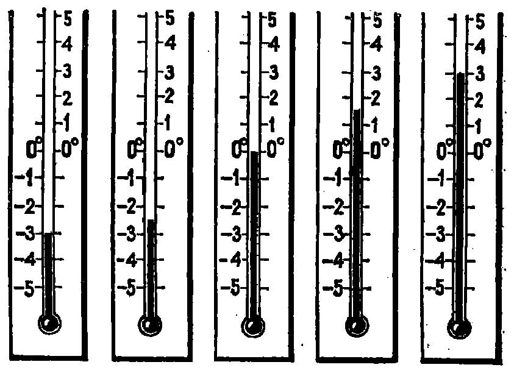

---
{
  "schema": "ld-s10y-lesson/page@3",
  "book": "5m",
  "page": 42,
  "printed_page": 33,
  "source": {
    "pdf": "5m 苏联十年制学校教材 数学 五年级.pdf",
    "pdf_sha256": "63de04ad3638091845160482903031cef4728857ad41aac477ffb473222cbe84",
    "pdf_page": 42
  },
  "render": {
    "dpi": 300,
    "w": 1504,
    "h": 2172,
    "sha256": "f0a054150188d64be3cdfeaf49b31ad8cf4d4e1e0e52bfec251edbb0d0cd5104"
  },
  "profile": {
    "id": "soviet-cn",
    "sha256": "dad8d974ba16880482f359073263269de8c405ccf8cb17dc4215fad11da44849"
  },
  "notes": [],
  "printed_lines": 15,
  "figures": [
    {
      "id": "fig-40",
      "label": "图 40",
      "box": [
        267,
        702,
        1043,
        120
      ]
    },
    {
      "id": "fig-41",
      "label": "图 41",
      "box": [
        388,
        1330,
        819,
        588
      ]
    }
  ],
  "provenance": {
    "cap": "1",
    "normalized": true
  }
}
---

<!-- h3 -->
10. 点在数轴上的移动

<!-- p -->
利用正数和负数不仅可以表示点在数轴上的位置，同时
还能表示点在数轴上的移动. 例如把点向右移动 3 个单位，
就说是移动 3 个单位，向左移动 3 个单位就说是移动 $-3$ 个
单位. 点 $A(1)$ 移动 3 个单位，就变成点 $B(4)$，而点 $A$ 移 $-3$
个单位，就变成点 $C(-2)$（图 40）.

<!-- fig 图 40 box 267,702,1043,120 -->

<!-- cap 图 40 -->
图 40

<!-- ex 149 -->
在数轴上标出点 $A(2)$. 向右移动 6 个单位时，这个点
变成哪点？向左移动 6 个单位呢？当移动 7 时，$A$ 点将
变到哪点？移动 $-7$ 呢？

<!-- ex 150 -->
点 $P(4)$ 在移动以后和点 $K(-2)$ 重合，点 $P$ 移动了几个
单位？如果它和点 $T(6)$ 相重合，又是移动了几个单位？

<!-- ex 151 open -->
读出图 41 中温度计的读数. 如果：

<!-- fig 图 41 box 388,1330,819,588 -->

<!-- cap 图 41 -->
图 41

<!-- foot -->
· 33 ·
