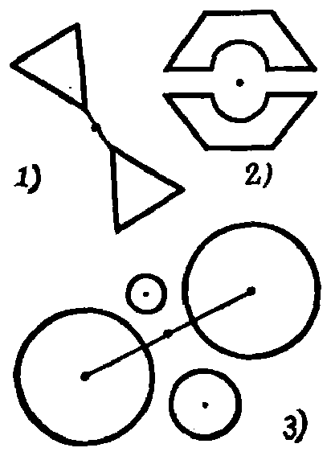
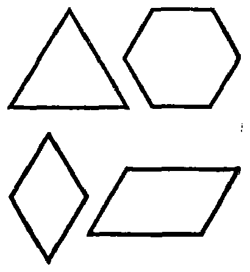

---
{
  "schema": "ld-s10y-lesson/page@3",
  "book": "5m",
  "page": 46,
  "printed_page": 37,
  "source": {
    "pdf": "5m 苏联十年制学校教材 数学 五年级.pdf",
    "pdf_sha256": "63de04ad3638091845160482903031cef4728857ad41aac477ffb473222cbe84",
    "pdf_page": 46
  },
  "render": {
    "dpi": 300,
    "w": 1504,
    "h": 2172,
    "sha256": "7396a00e18999a833d305db60aa88bb75f7c196828eec2a384953b51a622bc96"
  },
  "profile": {
    "id": "soviet-cn",
    "sha256": "dad8d974ba16880482f359073263269de8c405ccf8cb17dc4215fad11da44849"
  },
  "notes": [],
  "printed_lines": 17,
  "figures": [
    {
      "id": "fig-49",
      "label": "图 49",
      "box": [
        346,
        412,
        388,
        543
      ]
    },
    {
      "id": "fig-50",
      "label": "图 50",
      "box": [
        906,
        481,
        386,
        423
      ]
    }
  ],
  "provenance": {
    "cap": "1",
    "normalized": true
  }
}
---

<!-- ex 162 cont -->
点的对称图形.

<!-- ex 163 -->
找出图 49 中的一对中心对称图形. 指出它们的对称中
心.

<!-- fig 图 49 box 346,412,388,543 -->

<!-- cap 图 49 -->
图 49

<!-- fig 图 50 box 906,481,386,423 -->

<!-- cap 图 50 samerow -->
图 50

<!-- ex 164 -->
图 50 中哪个图形有对称中心？

<!-- ex 165 -->
作边长为 4 厘米的等边三角形. 作这个三角形的关于
一边中点的对称三角形. 这两个三角形的并集是什么图
形？它有没有对称中心？

<!-- ex 166 -->
作 $\angle MOP=135^\circ$. 作角 $MOP$ 的对顶角. 这个角是多少
度？

<!-- ex 167 -->
画相交的二直线. 这两条直线形成几对对顶角？

<!-- ex 168 -->
二直线相交时所形成的角中有一个是 $72^\circ$. 作图并求出
其它各角的度数.

<!-- exhead -->
复习题

<!-- ex 169 -->
$X$ 点的坐标为 $-3$. 它向右移动 5 个单位，变成 $B$ 点，而
向左移动 4 个单位，变为 $C$ 点. 求 $B$、$C$ 两点的坐标.

<!-- foot -->
· 37 ·
