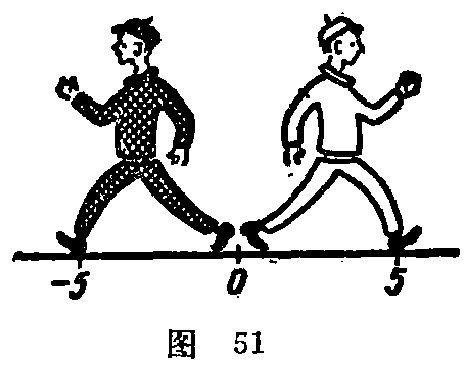

---
{
  "schema": "ld-s10y-lesson/page@3",
  "book": "5m",
  "page": 48,
  "printed_page": 39,
  "source": {
    "pdf": "5m 苏联十年制学校教材 数学 五年级.pdf",
    "pdf_sha256": "63de04ad3638091845160482903031cef4728857ad41aac477ffb473222cbe84",
    "pdf_page": 48
  },
  "render": {
    "dpi": 300,
    "w": 1504,
    "h": 2172,
    "sha256": "ce00b8ae92842eff60e216ae124c59a40daa3f5ed31f947dd0acf027b52fd72c"
  },
  "profile": {
    "id": "soviet-cn",
    "sha256": "dad8d974ba16880482f359073263269de8c405ccf8cb17dc4215fad11da44849"
  },
  "notes": [],
  "printed_lines": 23,
  "figures": [
    {
      "id": "fig-51",
      "label": "图 51",
      "box": [
        884,
        573,
        448,
        347
      ]
    }
  ],
  "provenance": {
    "cap": "1",
    "normalized": true
  }
}
---

<!-- ex 177 cont -->
额完成原计划的百分之几？

<!-- ex 178 -->
解方程：
1) $2.45\cdot(m-8.8)=4.41$；　　2) $7.54-3.6k=5.92$.

<!-- h3 -->
12. 相反数

<!-- p -->
坐标为 5 和 $-5$ 的两点（图 51）
和点 $O$ 的距离相等并且位于点 $O$ 的
两侧. 这两点关于点 $O$ 对称. 从点
$O$ 到这两个点，必须经过相等的距
离，但方向相反. 所以像 5 和 $-5$
这两个数叫做相反数. 5 和 $-5$ 相反，而 $-5$ 和 5 相反. 每个
数都有一个和它相反的数. 在数轴上，两个相反数用关于原
点的两个对称点表示. 0 的相反数是它本身.
数 $a$ 的相反数表示为 $-a$. 当 $a=-7.8$ 时，$-a=7.8$；当
$a=8.3$ 时，$-a=-8.3$；当 $a=0$ 时，$-a=0$.
“$-(-15)$”的写法表示数 $-15$ 的相反数. 因为 $-15$ 的
相反数等于 15，所以 $-(-15)$ 等于 15.
现在“$-25$”有两种读法：“负 25”和“25 的相反数”.
自然数、自然数的相反数和零叫做整数. 整数的集合用
字母 $Z$ 表示；自然数的集合用字母 $N$ 表示.
$Z=\{\ldots,-5,-4,-3,-2,-1,0,1,2,3,4,5,\ldots\}$；
$N=\{1,2,3,4,5,6,7,8,9,10,\ldots\}$.

<!-- fig 图 51 box 884,573,448,347 -->

<!-- cap 图 51 samerow -->
图 51

<!-- ex 179 open -->
求 $-276$，124，$-321$，62，9，$-1$，1，$-7.8$，$-9$，0.5，$-\frac{2}{3}$，

<!-- foot -->
· 39 ·
