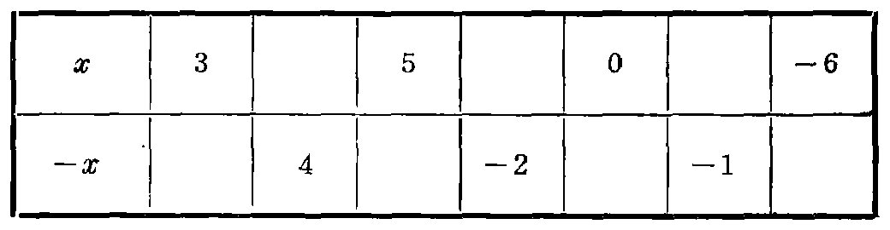

---
{
  "schema": "ld-s10y-lesson/page@3",
  "book": "5m",
  "page": 49,
  "printed_page": 40,
  "source": {
    "pdf": "5m 苏联十年制学校教材 数学 五年级.pdf",
    "pdf_sha256": "63de04ad3638091845160482903031cef4728857ad41aac477ffb473222cbe84",
    "pdf_page": 49
  },
  "render": {
    "dpi": 300,
    "w": 1504,
    "h": 2172,
    "sha256": "e2be50585417b793954dc8bf3b3f591544923f117bc2dbfb80a63682a3102c9f"
  },
  "profile": {
    "id": "soviet-cn",
    "sha256": "dad8d974ba16880482f359073263269de8c405ccf8cb17dc4215fad11da44849"
  },
  "notes": [],
  "printed_lines": 19,
  "figures": [
    {
      "id": "tbl-p0049-01",
      "label": "表",
      "box": [
        225,
        1089,
        1016,
        246
      ]
    },
    {
      "id": "fig-52",
      "label": "图 52",
      "box": [
        144,
        1465,
        1169,
        83
      ]
    }
  ],
  "provenance": {
    "cap": "1",
    "normalized": true
  }
}
---

<!-- ex 179 cont -->
$4\frac{1}{5}$ 等数的相反数.

<!-- ex 180 -->
用适当的数代替 * 号，使下列等式成立：
1) $-(-80)=*$；　　　　　2) $3.5=-*$；
3) $-(-247)=*$；　　　　4) $8.2=-*$.

<!-- ex 181 -->
求值：
1) 当 $m=-8.25,-1.6,-13$ 时，求 $-m$；
2) 当 $-k=27,-35,7.1,-6.9,80,-90$ 时，求 $k$；
3) 当 $t=41,-3.6,0$ 时，求 $-(-t)$.

<!-- ex 182 -->
假设数 $x$ 为：1) 负数；2) 零；3) 正数时，$-x$ 是什
么数？

<!-- ex 183 -->
填写下表中的空格，并在数轴上标出表中的各数.

<!-- fig 表 box 225,1089,1016,246 owner-ex 183 -->

<!-- ex 184 -->
求出 $A,B,C$ 三点的坐标（图 52）.

<!-- fig 图 52 box 144,1465,1169,83 -->

<!-- cap 图 52 -->
图 52

<!-- ex 185 -->
解方程：
1) $-x=607$；　　　2) $-a=-30.04$.

<!-- ex 186 -->
指出下面命题的真假：
1) $4\in N$；3) $0\in N$；5) $-5\in Z$；7) $1.2\in N$；
2) $4\in Z$；4) $0\in Z$；6) $-5\in N$；8) $1.2\in Z$.

<!-- foot -->
· 40 ·
