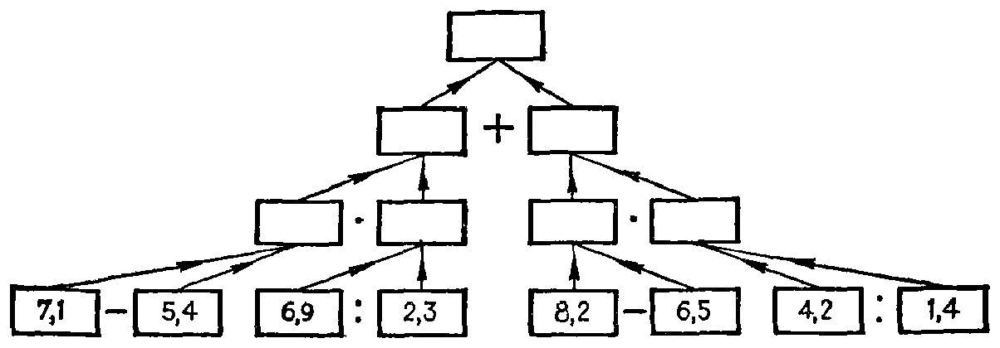
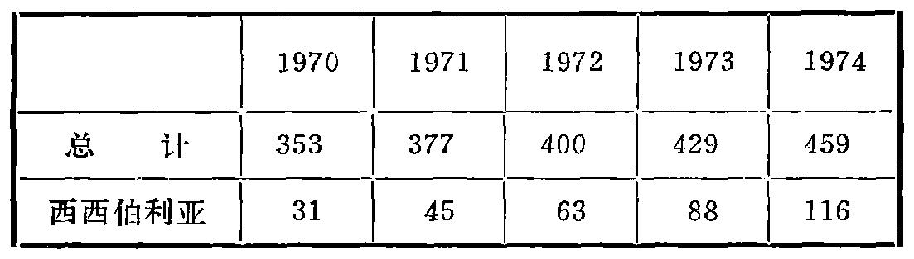

---
{
  "schema": "ld-s10y-lesson/page@3",
  "book": "5m",
  "page": 54,
  "printed_page": 45,
  "source": {
    "pdf": "5m 苏联十年制学校教材 数学 五年级.pdf",
    "pdf_sha256": "63de04ad3638091845160482903031cef4728857ad41aac477ffb473222cbe84",
    "pdf_page": 54
  },
  "render": {
    "dpi": 300,
    "w": 1504,
    "h": 2172,
    "sha256": "1c3cb7a150ef16d6edca81b962affe672fa89a07e905da8d809ae223a632b75e"
  },
  "profile": {
    "id": "soviet-cn",
    "sha256": "dad8d974ba16880482f359073263269de8c405ccf8cb17dc4215fad11da44849"
  },
  "notes": [],
  "printed_lines": 13,
  "figures": [
    {
      "id": "fig-54",
      "label": "图 54",
      "box": [
        186,
        260,
        1180,
        396
      ]
    },
    {
      "id": "tbl-p0054-02",
      "label": "表",
      "box": [
        241,
        945,
        1079,
        290
      ]
    }
  ],
  "provenance": {
    "cap": "1",
    "normalized": true
  }
}
---

<!-- fig 图 54 box 186,260,1180,396 -->

<!-- cap 图 54 -->
图 54

<!-- ex 213 open -->
下表列有 1970—1974 年间苏联的石油产量（以百万吨
计）并注明了这几年内西西伯利亚的石油产量.

<!-- fig 表 box 241,945,1079,290 owner-ex 213 -->

<!-- ex 213 cont -->
列表说明这几年内西西伯利亚的石油产量占苏联
石油总产量的百分比.

<!-- exhead -->
家庭作业题

<!-- ex 214 -->
在数轴上标出绝对值为 3，8，1，2 的各数.

<!-- ex 215 -->
写出能满足下列不等式的变量 $x$ 的整数值的集合：
1) $|x|<5$；　　　　　2) $|x|\leqslant6.3$.

<!-- ex 216 -->
计算下列各式的值：
1) $|-817|-|399|$；　　3) $|-564|+|-299|$；
2) $|-6.8|:|-1.7|$；　4) $|-24|\cdot|-125|$.

<!-- foot -->
· 45 ·
