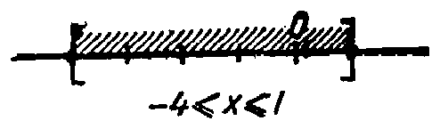
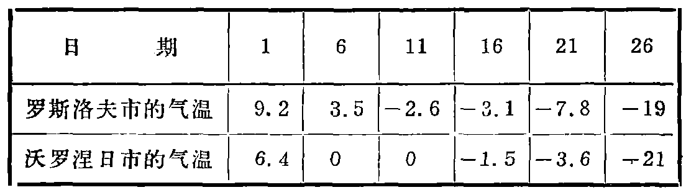

---
{
  "schema": "ld-s10y-lesson/page@3",
  "book": "5m",
  "page": 56,
  "printed_page": 47,
  "source": {
    "pdf": "5m 苏联十年制学校教材 数学 五年级.pdf",
    "pdf_sha256": "63de04ad3638091845160482903031cef4728857ad41aac477ffb473222cbe84",
    "pdf_page": 56
  },
  "render": {
    "dpi": 300,
    "w": 1504,
    "h": 2172,
    "sha256": "f05da370f13d7faad528615694daafe3c516f42e9be1efe66d439b4be3eb316c"
  },
  "profile": {
    "id": "soviet-cn",
    "sha256": "dad8d974ba16880482f359073263269de8c405ccf8cb17dc4215fad11da44849"
  },
  "notes": [],
  "printed_lines": 20,
  "figures": [
    {
      "id": "fig-57",
      "label": "图 57",
      "box": [
        889,
        422,
        470,
        121
      ]
    },
    {
      "id": "tbl-p0056-02",
      "label": "表",
      "box": [
        224,
        1576,
        1080,
        290
      ]
    }
  ],
  "provenance": {
    "cap": "1",
    "normalized": true
  }
}
---

<!-- p cont -->
假如在数轴上表示两个负数，那么左边的数绝对值较大.
所以在两个负数中，绝对值大的数较小，而绝对值小的数较大
（图 56）.

<!-- p open -->
在数轴上取端点坐标为 $-4$ 和
$1$ 的线段（图 57）. 这个线段上所有
点的坐标都满足不等式 $-4\leqslant x\leqslant1$.

<!-- fig 图 57 box 889,422,470,121 -->

<!-- cap 图 57 samerow -->
图 57

<!-- p cont -->
这个不等式没有其它解. 就是说，这个线段表示不等式
$-4\leqslant x\leqslant1$ 解的集合. 这个解的集合表示为 $[-4,1]$.

<!-- ex 220 -->
在数轴上标出下列各数：$0,1,3,-5,8,-7,-2,-10,$
$-3$. 比较下面每两个数的大小：
1) $0$ 和 $3$；　　　5) $-2$ 和 $3$；　　　9) $1$ 和 $8$；
2) $0$ 和 $-5$；　　6) $-7$ 和 $1$；　　　10) $-5$ 和 $-3$；
3) $8$ 和 $0$；　　　7) $1$ 和 $-10$；　　11) $-5$ 和 $-10$；
4) $-7$ 和 $0$；　　8) $3$ 和 $-3$；　　　12) $-2$ 和 $-5$.

<!-- ex 221 -->
分别在 12 月 1，6，11，16，21，26 日中午 12 时测量了罗斯
托夫和沃罗涅日两市的气温. 测量结果（以摄氏度数计）
列于下表. 比较罗斯托夫和沃罗涅日两市同日气温的
高低.

<!-- fig 表 box 224,1576,1080,290 owner-ex 221 -->

<!-- ex 222 open -->
用“小于”号或“大于”号代替星号，使成真不等式：

<!-- foot -->
· 47 ·
