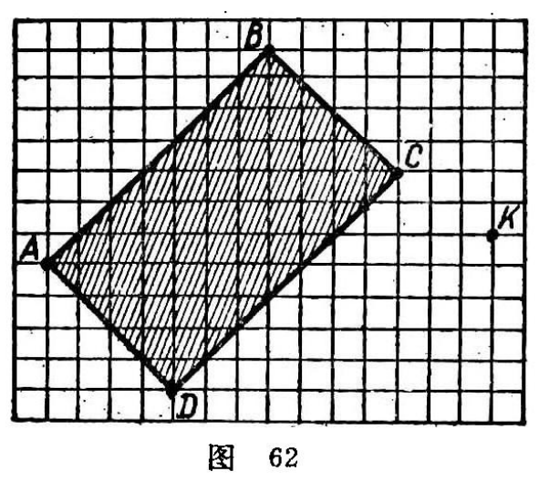
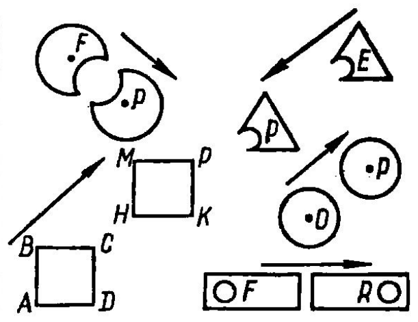
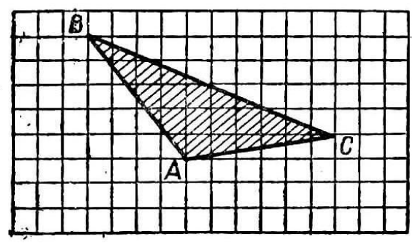

---
{
  "schema": "ld-s10y-lesson/page@3",
  "book": "5m",
  "page": 62,
  "printed_page": 53,
  "source": {
    "pdf": "5m 苏联十年制学校教材 数学 五年级.pdf",
    "pdf_sha256": "63de04ad3638091845160482903031cef4728857ad41aac477ffb473222cbe84",
    "pdf_page": 62
  },
  "render": {
    "dpi": 300,
    "w": 1504,
    "h": 2172,
    "sha256": "50b4558f7fcb5f493b7305dca5f3ec0de950d244049de510d64e102b49c353cf"
  },
  "profile": {
    "id": "soviet-cn",
    "sha256": "dad8d974ba16880482f359073263269de8c405ccf8cb17dc4215fad11da44849"
  },
  "notes": [],
  "printed_lines": 14,
  "figures": [
    {
      "id": "fig-62",
      "label": "图 62",
      "box": [
        202,
        573,
        567,
        504
      ]
    },
    {
      "id": "fig-63",
      "label": "图 63",
      "box": [
        785,
        571,
        587,
        447
      ]
    },
    {
      "id": "fig-64",
      "label": "图 64",
      "box": [
        507,
        1389,
        564,
        321
      ]
    }
  ],
  "provenance": {
    "cap": "1",
    "normalized": true
  }
}
---

<!-- ex 245 -->
作边长 4 厘米的正方形 $ABCD$，并且在这个正方形外取
点 $A_1$. 平移正方形，使点 $A$ 移到点 $A_1$.

<!-- ex 246 -->
图 62 中画有长方形 $ABCD$ 和点 $K$. 平移这个长方形，
使点 $A$ 与点 $K$ 重合. 平移同一长方形，使点 $C$ 与点 $K$
重合.

<!-- fig 图 62 box 202,573,567,504 -->

<!-- fig 图 63 box 785,571,587,447 -->

<!-- cap 图 62 -->
图 62

<!-- cap 图 63 samerow -->
图 63

<!-- ex 247 -->
图 63 中哪些图形是由另一个图形平移得来的？

<!-- ex 248 -->
图 64 中画有三角形 $ABC$. 在自己的练习本上作同样的
三角形并且使它向下平移七个格. 再把所得的三角形向
右移 4 个格.

<!-- fig 图 64 box 507,1389,564,321 -->

<!-- cap 图 64 -->
图 64

<!-- exhead -->
复习题

<!-- ex 249 open -->
假设松鼠在树上停留点的坐标为 $x$，而啄木鸟落的点的

<!-- foot -->
· 53 ·
