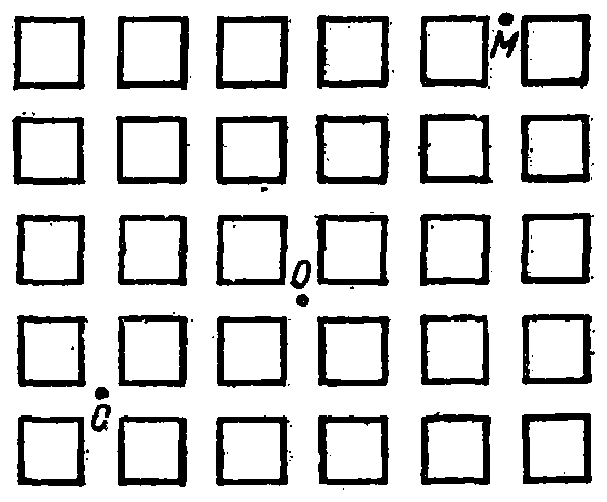
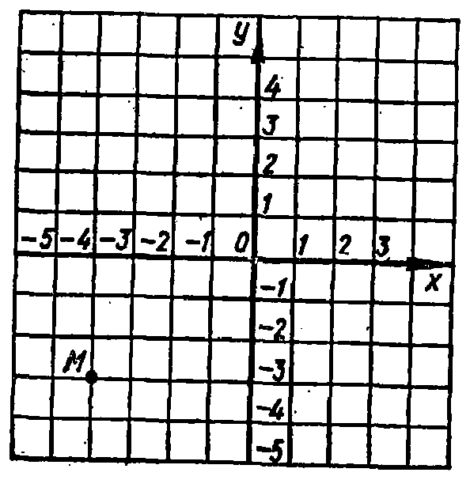

---
{
  "schema": "ld-s10y-lesson/page@3",
  "book": "5m",
  "page": 65,
  "printed_page": 56,
  "source": {
    "pdf": "5m 苏联十年制学校教材 数学 五年级.pdf",
    "pdf_sha256": "63de04ad3638091845160482903031cef4728857ad41aac477ffb473222cbe84",
    "pdf_page": 65
  },
  "render": {
    "dpi": 300,
    "w": 1504,
    "h": 2172,
    "sha256": "d896e6a5d6782bac4b2f354fda3143313525f6810deb6b9046f7c56a35b6657f"
  },
  "profile": {
    "id": "soviet-cn",
    "sha256": "dad8d974ba16880482f359073263269de8c405ccf8cb17dc4215fad11da44849"
  },
  "notes": [],
  "printed_lines": 19,
  "figures": [
    {
      "id": "fig-65",
      "label": "图 65",
      "box": [
        438,
        257,
        583,
        478
      ]
    },
    {
      "id": "fig-66",
      "label": "图 66",
      "box": [
        724,
        1332,
        570,
        583
      ]
    }
  ],
  "provenance": {
    "cap": "1",
    "normalized": true
  }
}
---

<!-- fig 图 65 box 438,257,583,478 -->

<!-- cap 图 65 -->
图 65

<!-- p cont -->
要想从点 $O$ 到点 $C$，必须向左走两个街坊，然后向下一
个街坊. 这时走的方向和以前相反. 所以 $C$ 点的位置是由
$-2$ 和 $-1$ 确定的.

<!-- p open -->
在平面上，作两条互相垂直并且相交于点 $O$ 的直线 $Ox$ 和
$Oy$. 为了确定点在平面上的位置，用平行于 $Ox$ 和 $Oy$ 的许多
直线把平面划分成边长为 1 的许多正方形. 这在直线 $Ox$ 和
$Oy$ 上就作出了刻度. 根据这些刻度给定两个数，就能很容易
地确定平面上的任一点的位

<!-- fig 图 66 box 724,1332,570,583 -->

<!-- p cont open -->
置. 例如 $-4$ 和 $-3$ 二数给
定了图 66 中的点 $M$. 要从
$O$ 点到 $M$ 点，必须先向左走
4 个单位，然后向下走 3 个
单位. $-4$ 叫做点 $M$ 的横坐
标，$-3$ 叫做点 $M$ 的纵坐标，
写成：$M(-4,-3)$. 点的横
坐标写在前面，纵坐标写在
后面. 两个数合起来叫做点

<!-- cap 图 66 samerow -->
图 66

<!-- foot -->
· 56 ·
