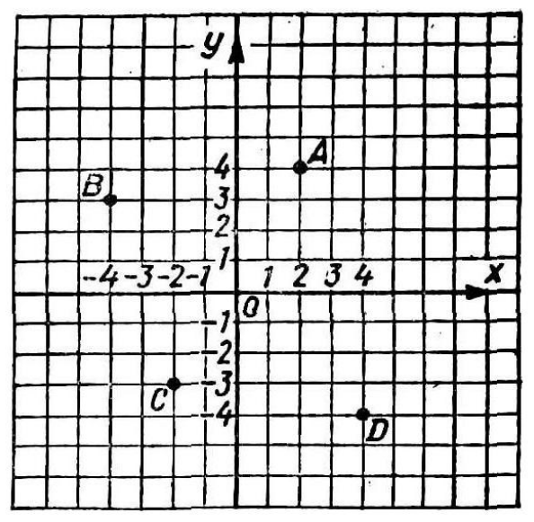
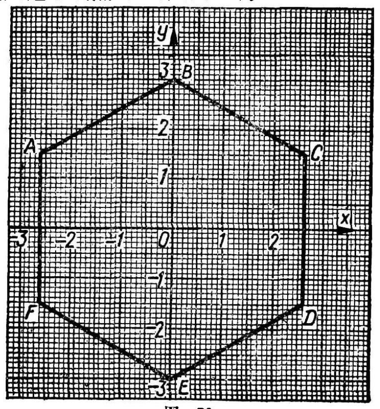

---
{
  "schema": "ld-s10y-lesson/page@3",
  "book": "5m",
  "page": 67,
  "printed_page": 58,
  "source": {
    "pdf": "5m 苏联十年制学校教材 数学 五年级.pdf",
    "pdf_sha256": "63de04ad3638091845160482903031cef4728857ad41aac477ffb473222cbe84",
    "pdf_page": 67
  },
  "render": {
    "dpi": 300,
    "w": 1504,
    "h": 2176,
    "sha256": "6eea5a4f2ee771ec9cd48f3cbb767576919a395b9f08d2fb569d0216b62f52e9"
  },
  "profile": {
    "id": "soviet-cn",
    "sha256": "dad8d974ba16880482f359073263269de8c405ccf8cb17dc4215fad11da44849"
  },
  "notes": [],
  "printed_lines": 15,
  "figures": [
    {
      "id": "fig-69",
      "label": "图 69",
      "box": [
        725,
        240,
        570,
        557
      ]
    },
    {
      "id": "fig-70",
      "label": "图 70",
      "box": [
        365,
        1149,
        754,
        814
      ]
    }
  ],
  "provenance": {
    "cap": "1",
    "normalized": true
  }
}
---

<!-- ex 263 cont -->
三个点的坐标.

<!-- ex 264 -->
作坐标轴 $Ox,Oy$ 并且标
出下列各点：$A(2,8)$，
$B(3,-4),C(-4,5)$，
$D(-3,-7),E(0,5)$，
$M(0,-4),K(6,0)$，
$P(-7,0)$.

<!-- fig 图 69 box 725,240,570,557 -->

<!-- ex 265 -->
求出 $A,B,C,D$ 各点的
坐标（图 69）.

<!-- cap 图 69 samerow -->
图 69

<!-- ex 266 -->
说出坐标为 $0,0$ 的点（参看图 69）.

<!-- ex 267 -->
作直角坐标系并且按下列已知顶点坐标作四边形
$ABCD$：$A(-10,2),B(-2,-2),C(-2,-6),D(-10,-6)$.

<!-- ex 268 -->
说出六边形顶点的坐标（图 70）.

<!-- fig 图 70 box 365,1149,754,814 -->

<!-- cap 图 70 -->
图 70

<!-- foot -->
· 58 ·
