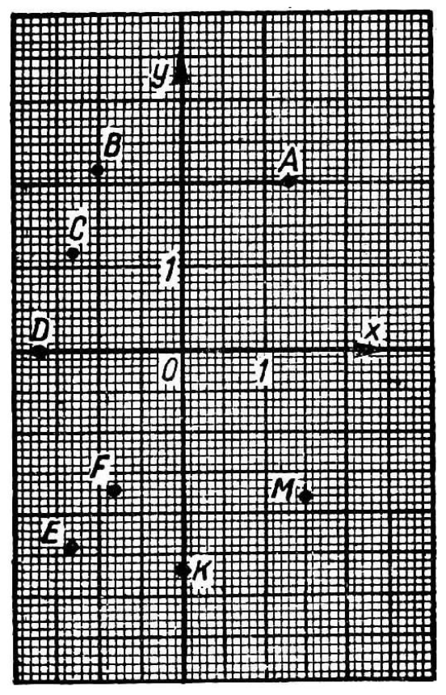
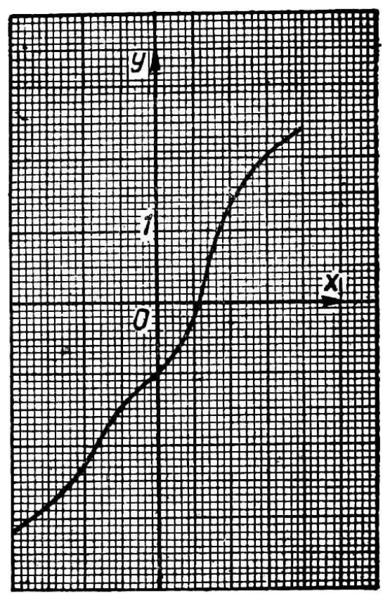

---
{
  "schema": "ld-s10y-lesson/page@3",
  "book": "5m",
  "page": 68,
  "printed_page": 59,
  "source": {
    "pdf": "5m 苏联十年制学校教材 数学 五年级.pdf",
    "pdf_sha256": "63de04ad3638091845160482903031cef4728857ad41aac477ffb473222cbe84",
    "pdf_page": 68
  },
  "render": {
    "dpi": 300,
    "w": 1504,
    "h": 2172,
    "sha256": "c4a698ce14bae0f7b825b6085a286c06ecc7f3ea59f7cdbae7332c03e10c0c34"
  },
  "profile": {
    "id": "soviet-cn",
    "sha256": "dad8d974ba16880482f359073263269de8c405ccf8cb17dc4215fad11da44849"
  },
  "notes": [],
  "printed_lines": 14,
  "figures": [
    {
      "id": "fig-71",
      "label": "图 71",
      "box": [
        240,
        371,
        528,
        835
      ]
    },
    {
      "id": "fig-72",
      "label": "图 72",
      "box": [
        826,
        368,
        531,
        830
      ]
    }
  ],
  "provenance": {
    "cap": "1",
    "normalized": true
  }
}
---

<!-- ex 269 -->
在坐标纸上（图 71）标出 $A,B,C,D,E,F,K,M$ 各点. 找
出各点的坐标.

<!-- fig 图 71 box 240,371,528,835 -->

<!-- fig 图 72 box 826,368,531,830 -->

<!-- cap 图 71 -->
图 71

<!-- cap 图 72 samerow -->
图 72

<!-- ex 270 -->
在坐标平面上作一条线（图 72），找出这条线上的以下
各点：
1) 横坐标为 $2,1.7,-1.8$；
2) 纵坐标为 $1.8,2.1,-1.3,-3.1,-2.5$.

<!-- ex 271 -->
已知点的集合 $\{A,B,C,D,E\}$，其中 $A(1,3),B(-1,4)$，
$C(7,-5),D(0,6),E(-4,0)$. 在大括号内写出由下列
各点组成的子集：1) 位于 $Ox$ 轴以上，2) 在 $Oy$ 轴的
左边.

<!-- ex 272 -->
标出坐标为 $A(6,-2),B(-2,6),E(5,5)$ 的各点. 找
出直线 $OE$ 和线段 $AB$ 的交点的坐标.

<!-- foot -->
· 59 ·
