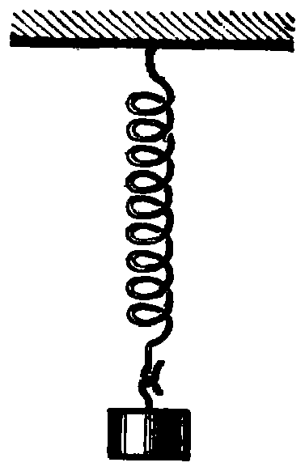
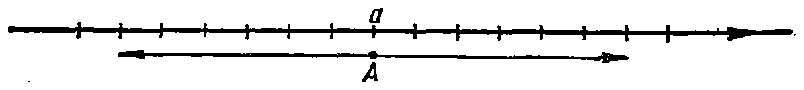

---
{
  "schema": "ld-s10y-lesson/page@3",
  "book": "5m",
  "page": 71,
  "printed_page": 62,
  "source": {
    "pdf": "5m 苏联十年制学校教材 数学 五年级.pdf",
    "pdf_sha256": "63de04ad3638091845160482903031cef4728857ad41aac477ffb473222cbe84",
    "pdf_page": 71
  },
  "render": {
    "dpi": 300,
    "w": 1504,
    "h": 2172,
    "sha256": "3dc2211baeb773dd7018f35374feea0f18e29ba48a350e40039165188051db0d"
  },
  "profile": {
    "id": "soviet-cn",
    "sha256": "dad8d974ba16880482f359073263269de8c405ccf8cb17dc4215fad11da44849"
  },
  "notes": [],
  "printed_lines": 22,
  "figures": [
    {
      "id": "fig-73",
      "label": "图 73",
      "box": [
        901,
        978,
        353,
        558
      ]
    },
    {
      "id": "fig-74",
      "label": "图 74",
      "box": [
        134,
        1798,
        1172,
        111
      ]
    }
  ],
  "provenance": {
    "cap": "1",
    "normalized": true
  }
}
---

<!-- ex 285 -->
计算：
1) $27\,784:46\cdot208-41\,419-(5078+3065)$；
2) $185\cdot216:37+58\,602-(31\,600-29\,097)$.

<!-- h2 -->
§ 3. 加法和减法

<!-- h3 -->
17. 量的变化

<!-- p -->
气温可以往两个方向变化：升高或降低. 例如，设早晨的
气温是 $3^\circ\mathrm{C}$，中午 $9^\circ\mathrm{C}$，晚上 $7^\circ\mathrm{C}$. 上午气温升高 $6^\circ\mathrm{C}$，下午降
低 $2^\circ\mathrm{C}$. 气温的升高用正数表示，降低就用负数表示. 假如
温度上升 $6^\circ\mathrm{C}$，我们可以说它变化了 $6^\circ\mathrm{C}$. 如果气温降低了
$2^\circ\mathrm{C}$，可以说它变化了 $-2^\circ\mathrm{C}$.

<!-- p open -->
弹簧的长度能往两个方向变化：
延长或缩短（图 73）. 延长用正数表
示，缩短用负数表示. 假如说弹簧的
长度变化了 $-6$ 毫米，这就是说它缩
短了 6 毫米. 如果说弹簧的长度变化
了 10 毫米，这就意味着它延长了 10
毫米.

<!-- fig 图 73 box 901,978,353,558 -->

<!-- cap 图 73 samerow -->
图 73

<!-- p cont -->
假设数 $a$ 变化了 6 个单位，那么
点 $A(a)$ 就是向右移动了 6 个单位. 如果数 $a$ 变化了 $-6$，就
是点 $A(a)$ 向左移动了 6 个单位（图 74）.

<!-- fig 图 74 box 134,1798,1172,111 -->

<!-- cap 图 74 -->
图 74

<!-- foot -->
· 62 ·
